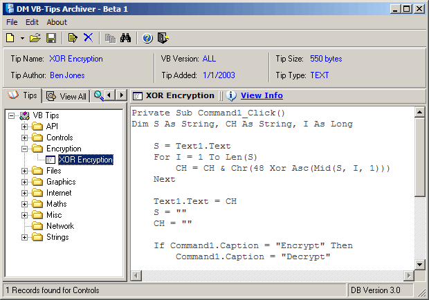



## VB Sniplet Achiver Beta 1

### Description

Hi this is the seconed tie I uploaded to PSCode as my first one was deleted for some resaon anyway I uploaded agian also fixed the db error anyway this is a program I made for programmers to keep all there source-code safe and in an easy to find place at the moment you can Add, Delete and Edit you can also save the tips to text files code I also got many updates to do such as DB backup and export code options anyway hope you like the code please vote.
 
### More Info
 

             |
---                |---
**Submitted On**   |2003-03-02 03:53:58
**By**             |[dreamvb](https://github.com/Planet-Source-Code/PSCIndex/blob/master/ByAuthor/dreamvb.md)
**Level**          |Intermediate
**User Rating**    |5.0 (15 globes from 3 users)
**Compatibility**  |VB 5\.0, VB 6\.0
**Category**       |[Complete Applications](https://github.com/Planet-Source-Code/PSCIndex/blob/master/ByCategory/complete-applications__1-27.md)
**World**          |[Visual Basic](https://github.com/Planet-Source-Code/PSCIndex/blob/master/ByWorld/visual-basic.md)
**Archive File**   |[VB\_Sniplet155319322003\.zip](https://github.com/Planet-Source-Code/dreamvb-vb-sniplet-achiver-beta-1__1-43674/archive/master.zip)

